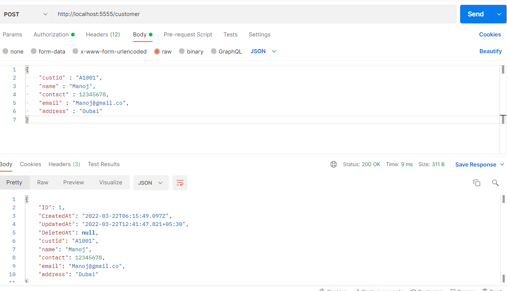

<h1 align="center"> CRUD Operation Using Golang </h1>

This repository consist CRUD Operation files using Golang(Gorilla/Mux).

The following prerequisites are required:

1. Install MySQL Workbench, configure database and connect (These infomations are available in db-connection.go)
2. Install Postman to do CRUD Operation 

The following Specifications has to be done: 

1. MySQL based webserver listening on localhost at certain specified port for user requests  
2. Endpoints  
    * /customer -  
        - POST Method - Create a Customer  
    * /customers -  
        - GET Method - Get All Customer information in database  
    * /customer/{id}  
        -  GET Method - Get Information about customer using ID  
        -  POST Method - Update Customer Information  
        -  DELETE Method - Delete the Customer

Persistence storage
   * The Registered Customer information will be stored in a database

## Tasks

User needs to compile packages using the command **Go Build**, then **.exe** file will be generated. These file needs to be executed to start CRUD operations

### 1. Creating Database 
Database will be created during migration and do the manipulations (POSTMAN) for the Endpoints  

### 2. Registration  

  

Customer can be register on POSTMAN "/customer" Endpoint with POST Method in json format and these Customer details will be updated in Database  
  
user can View all customers information on POSTMAN "/customers" Endpoint with GET Method.
  
user can View customer information by ID on POSTMAN "/customer/id" Endpoint with GET Method.
  
###3. Update user  

User can update or change customer information at "/customer/id" Endpoint with PUT Method.  

  

### 4. Delete user  

  
User can delete any Customer by ID, "/customer/id" Endpoint with DELETE Method.   

  

<h2>Useful Links :</h2>

| **Sl. No.** | **Link** | **Remarks** |
----------|--------------|--------------
1| [Go Tutorial Basic](https://www.youtube.com/watch?v=ty49_v1tV44) | Golang Tutorial for Beginners (Navin Reddy) |
2| [Golang REST API With Mux ](https://www.youtube.com/watch?v=SonwZ6MF5BE) | Golang REST API With Mux (Traversy Media
) |

